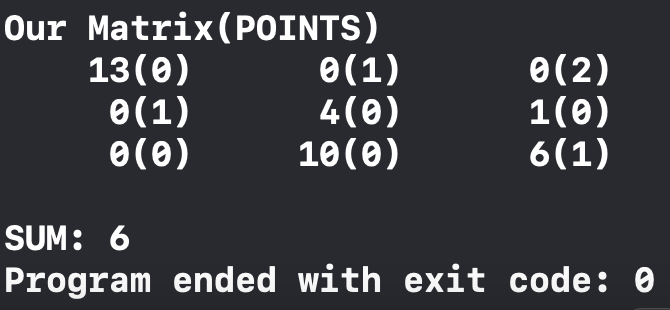

<h1>
    Hungarian method
</h1>

The task of planning is to find the maximum pairing in a weighted bipartite graph, you need to find the maximum pairing so that the sum of assignments was minimal. The Hungarian algorithm consists of the following steps:

1) In each column of the matrix we find the minimum elements and subtract from each element of this column. 
2) In each row of matrices we find the minimum elements and subtract from each element of the column. 
3) At least one "0" should be seen in each row and column. From this matrix we take all "0" and replace it with "1". 
4) Find the maximum pairing. If we get an improved version, transfer it to the first matrix, get the minimum amount and go to point 16 of the algorithm). If not, do the following. 
5) On this matrix we note the zeros that are included in the solution from step 4 and those that are not included (cross out). Note the lines that have fixed "0". 
6) Note those columns in which there are fixed zeros of these rows. 
7) Note the line containing the marked "0", which contains the line marked in the previous step. 
8) Note the column in which there is a fixed "0", which contains the row marked in the previous step. 
9) Mark the dotted columns and unmarked rows. 
10) Write the elements that pass through the dotted lines and look for the minimum elements among them. 
11) Subtract this minimum product from those columns of matrices through which dotted lines do not pass. 
12) Add these products to these lines through which the dotted lines pass. 
13) The combined units are transferred to the initial matrix. 
14) We turn to point 4 
15) The end of the solution. 

   Code:
  
          int size = SizeM;
          T** initial_array = matrix;
          out();
      
          delete_min_from_rows(matrix, size);
          delete_min_from_columns(matrix, size);
          out();
      
          point** final_array = set_zeros(matrix, size);
      
          if (!check_every_column_has_zero(final_array, size)) {
              cout << "Second STEP!" << endl;
              second_step(final_array, size);
              set_zeros(final_array, size);
          }
      
          int sum = find_sum(initial_array, final_array, size);
          cout << "SUM: " << sum << endl;

Output:

    

